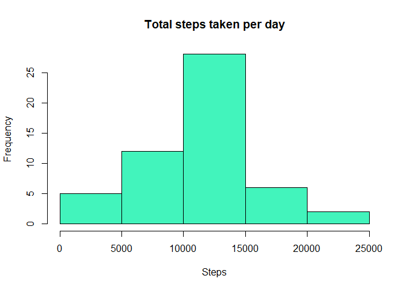
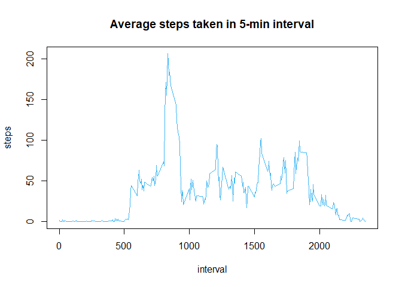
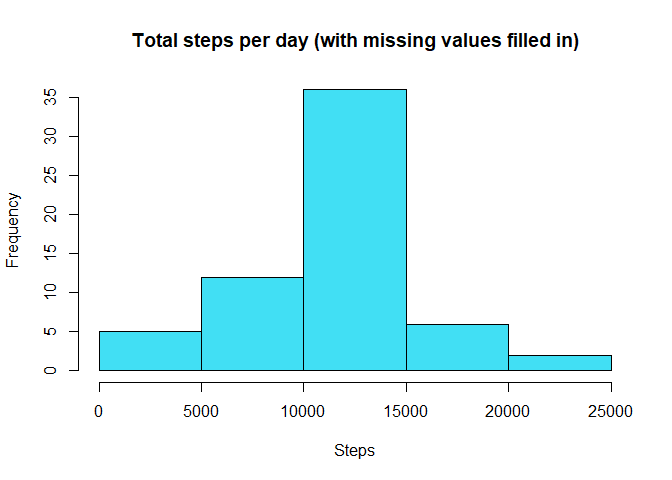
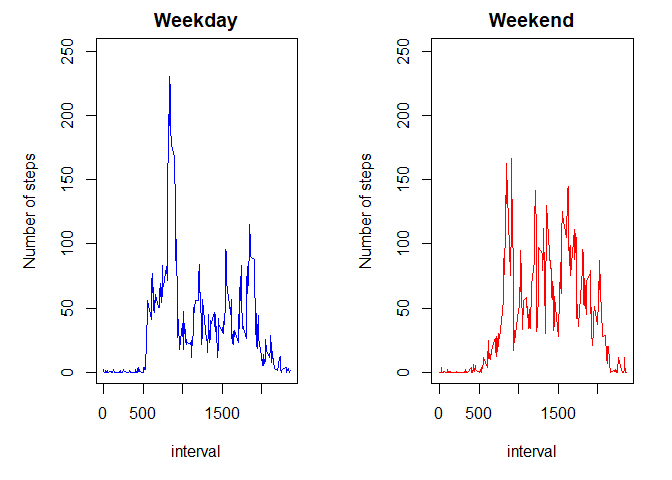

### Loading and preprocessing the data

Load the data:

```r
data <- read.csv("./data/activity.csv", header=TRUE)
```

Show the original data(first few rows):

```r
head(data)
```

```
##   steps       date interval
## 1    NA 2012-10-01        0
## 2    NA 2012-10-01        5
## 3    NA 2012-10-01       10
## 4    NA 2012-10-01       15
## 5    NA 2012-10-01       20
## 6    NA 2012-10-01       25
```


### What is mean total number of steps taken per day?

For this part of the assignment, you can ignore the missing values in the dataset.

Calculate the total number of steps based on each days

```r
stepsDay <- aggregate(steps~date, data, sum)
head(stepsDay)
```

```
##         date steps
## 1 2012-10-02   126
## 2 2012-10-03 11352
## 3 2012-10-04 12116
## 4 2012-10-05 13294
## 5 2012-10-06 15420
## 6 2012-10-07 11015
```

Plot a histogram of the total number of steps taken each day

```r
#Colour taken from Hex color code picker
hist(stepsDay$steps, col= "#42f4bc", xlab = "Steps", main = "Total steps taken per day")
```

<!-- -->

Calculate the mean and median of total steps taken

```r
mean1 <- mean(stepsDay$steps)
mean1
```

```
## [1] 10766.19
```

```r
median1 <- median(stepsDay$steps)
median1
```

```
## [1] 10765
```
### What is the average daily activity pattern?
Subset the original data to calculate the average number of steps taken of the 5-minute interval

```r
avgSteps <- aggregate(steps~interval, data, mean)
head(avgSteps)
```

```
##   interval     steps
## 1        0 1.7169811
## 2        5 0.3396226
## 3       10 0.1320755
## 4       15 0.1509434
## 5       20 0.0754717
## 6       25 2.0943396
```

Make a time series plot (i.e. type = "l") of the 5-minute interval (x-axis) and the average number of steps taken, averaged across all days (y-axis)

```r
with(avgSteps, plot(interval, steps
                , type="l", main="Average steps taken in 5-min interval"
                , col = "#41b8f4")) 
```

<!-- -->

Which 5-minute interval, on average across all the days in the dataset, contains the maximum number of steps?

The max number of steps & corresponding interval are:

```r
max <- max(avgSteps$steps)
max
```

```
## [1] 206.1698
```

```r
subsetData <- subset(avgSteps, steps == max)
subsetData$interval
```

```
## [1] 835
```

## Imputing missing values
Note that there are a number of days/intervals where there are missing values (coded as NA). The presence of missing days may introduce bias into some calculations or summaries of the data.

Calculate and report the total number of missing values in the dataset (i.e. the total number of rows with NAs)

```r
colSums(is.na(data))
```

```
##    steps     date interval 
##     2304        0        0
```

Create a new column "newSteps" contains the average steps

```r
data$newSteps <- avgSteps$steps
head(data)
```

```
##   steps       date interval  newSteps
## 1    NA 2012-10-01        0 1.7169811
## 2    NA 2012-10-01        5 0.3396226
## 3    NA 2012-10-01       10 0.1320755
## 4    NA 2012-10-01       15 0.1509434
## 5    NA 2012-10-01       20 0.0754717
## 6    NA 2012-10-01       25 2.0943396
```

Fill in the missing data in the original steps column

```r
data$steps[is.na(data$steps)] <- data$newSteps
```

```
## Warning in data$steps[is.na(data$steps)] <- data$newSteps: number of items
## to replace is not a multiple of replacement length
```

```r
head(data)
```

```
##       steps       date interval  newSteps
## 1 1.7169811 2012-10-01        0 1.7169811
## 2 0.3396226 2012-10-01        5 0.3396226
## 3 0.1320755 2012-10-01       10 0.1320755
## 4 0.1509434 2012-10-01       15 0.1509434
## 5 0.0754717 2012-10-01       20 0.0754717
## 6 2.0943396 2012-10-01       25 2.0943396
```

Create a new dataset that is equal to the original dataset but with the missing data filled in

```r
data$newSteps <- NULL
newdata <- data
head(newdata)
```

```
##       steps       date interval
## 1 1.7169811 2012-10-01        0
## 2 0.3396226 2012-10-01        5
## 3 0.1320755 2012-10-01       10
## 4 0.1509434 2012-10-01       15
## 5 0.0754717 2012-10-01       20
## 6 2.0943396 2012-10-01       25
```

Subset in the new data set to calculate the total number of steps per day

```r
sumdata <- aggregate(steps~date, newdata, sum)
head(sumdata)
```

```
##         date    steps
## 1 2012-10-01 10766.19
## 2 2012-10-02   126.00
## 3 2012-10-03 11352.00
## 4 2012-10-04 12116.00
## 5 2012-10-05 13294.00
## 6 2012-10-06 15420.00
```

Make a histogram of the total number of steps taken each day

```r
hist(sumdata$steps, col = "#41dff4"
     , xlab = "Steps"
     , main = "Total steps per day (with missing values filled in)")
```

<!-- -->

Calculate the mean and median of the total number of steps taken per day

```r
mean2 <- mean(sumdata$steps)
mean2
```

```
## [1] 10766.19
```

```r
median2 <- median(sumdata$steps)
median2
```

```
## [1] 10766.19
```

Calculate the differences of the mean and median between the first(with missing values) and second part(with missing filled in)

```r
mean2 - mean1
```

```
## [1] 0
```

```r
median2 - median1
```

```
## [1] 1.188679
```
## Are there differences in activity patterns between weekdays and weekends?
Create two new variables weekdays & weekends as factor variables.


```r
library(timeDate)
```

```
## Warning: package 'timeDate' was built under R version 3.5.1
```

```r
newdata$Weekday <- isWeekday(newdata$date)
head(newdata)
```

```
##       steps       date interval Weekday
## 1 1.7169811 2012-10-01        0    TRUE
## 2 0.3396226 2012-10-01        5    TRUE
## 3 0.1320755 2012-10-01       10    TRUE
## 4 0.1509434 2012-10-01       15    TRUE
## 5 0.0754717 2012-10-01       20    TRUE
## 6 2.0943396 2012-10-01       25    TRUE
```

calculate the average steps for weekday and weekend
Weekday

```r
weekday <- subset(newdata, newdata$Weekday == "TRUE")
weekdayMean <- aggregate(steps ~ interval, data = weekday, mean)
head(weekdayMean)
```

```
##   interval      steps
## 1        0 2.25115304
## 2        5 0.44528302
## 3       10 0.17316562
## 4       15 0.19790356
## 5       20 0.09895178
## 6       25 1.59035639
```

Weekend

```r
weekend <- subset(newdata, newdata$Weekday == "FALSE")
weekendMean <- aggregate(steps ~ interval, data = weekend, mean)
head(weekendMean)
```

```
##   interval       steps
## 1        0 0.214622642
## 2        5 0.042452830
## 3       10 0.016509434
## 4       15 0.018867925
## 5       20 0.009433962
## 6       25 3.511792453
```

Make the panel plot to calculate the average number of steps taken for weekday and weekend

```r
par(mfrow=c(1,2), mar=c(5,5,2,2))
plot(weekdayMean$interval, weekdayMean$steps, ylim=c(1, 250)
     , xlab = "interval", ylab = "Number of steps"
     , main ="Weekday", col ="blue", type="l")

plot(weekendMean$interval, weekendMean$steps, ylim=c(1,250)
     , xlab = "interval", ylab = "Number of steps"
     , main ="Weekend", col ="red", type="l")
```

<!-- -->
